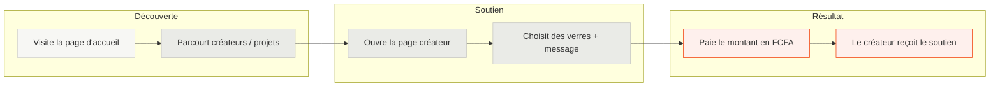
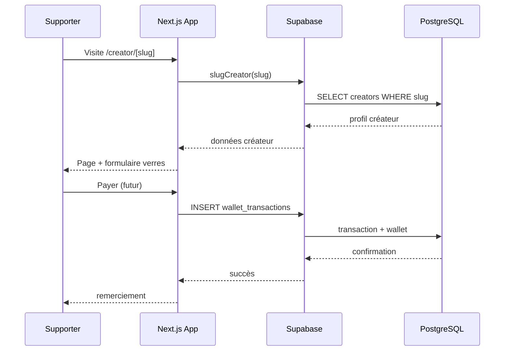
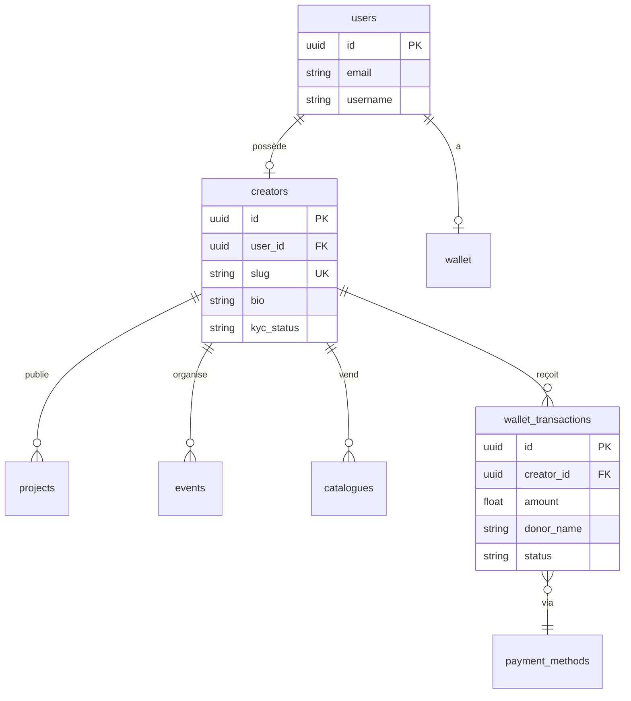

# PMUV — Offremoiunverre

## But de l'application

**Offremoiunverre** (dépôt `pmuv`) est une plateforme de soutien aux créateurs de contenu, inspirée de l'expérience conviviale d'un bar : au lieu d'un don abstrait, les supporters **offrent un ou plusieurs « verres »** à leur créateur préféré, avec un message personnalisé. L'objectif est de rendre le financement participatif **simple, chaleureux et accessible**, notamment dans un contexte où les paiements mobiles et le franc CFA (FCFA) sont pertinents (prix unitaire d'un verre : **1 200 FCFA**).

La plateforme s'adresse à deux publics :

| Rôle | Objectif |
|------|----------|
| **Créateur** | Créer une page personnalisée (`/creator/[slug]`), partager son lien, suivre ses revenus et ses supporters depuis un tableau de bord. |
| **Supporter** | Découvrir des créateurs, choisir un nombre de verres, laisser un message et payer pour soutenir. |

Des fonctionnalités complémentaires sont prévues ou en cours (membership, boutique, posts exclusifs, projets, événements, catalogue produits), sur le modèle de plateformes comme Patreon ou Ko-fi, mais avec une identité visuelle et narrative centrée sur le **verre**.

---

## Description produit

Offremoiunverre permet aux créateurs (artistes, streamers, podcasteurs, etc.) de monétiser leur communauté sans complexité technique. Après inscription via Supabase Auth (email/mot de passe, Google, Facebook), le créateur configure son profil (bio, couleur de thème, slug unique) et obtient une URL publique du type `offremoiunverre.com/[slug]`. Les visiteurs y accèdent, sélectionnent 1, 3, 5 ou 10 verres (ou une quantité personnalisée), rédigent un message, puis déclenchent le paiement. Le tableau de bord agrège les gains, liste les supporters et rappelle de configurer un moyen de versement (payout) avant de recevoir les fonds.

Le backend repose sur **Supabase** (PostgreSQL + Auth) avec un schéma centré sur les entités `users`, `creators`, `wallet`, `wallet_transactions`, ainsi que des contenus annexes (`projects`, `events`, `catalogues`) pour étendre l'offre au-delà du simple don.

---

## Parcours utilisateur



### Parcours créateur (inscription → dashboard)

1. S'inscrire (`/signup`) ou se connecter (`/login`)
2. Être redirigé vers `/dashboard`
3. Personnaliser sa page et partager son lien
4. Configurer le payout (bannière « Complete setup »)
5. Consulter revenus et supporters

---

## Architecture technique

### Stack

| Couche | Technologie |
|--------|-------------|
| Framework | Next.js 16 (App Router) |
| UI | React 19, Tailwind CSS 4, shadcn/ui (Radix) |
| Données & Auth | Supabase (`@supabase/supabase-js`) |
| Formulaires | react-hook-form + zod |
| Package manager | pnpm |

### Structure des routes

```
src/app/
├── (home)/              # Site public
│   ├── page.tsx         # Landing
│   ├── creators/        # Liste créateurs
│   ├── creator/[slug]/  # Page publique créateur
│   ├── projects/        # Projets
│   ├── events/          # Événements
│   ├── search/          # Recherche
│   └── box/             # Démo PaymentBox
├── (onboarding)/        # login, signup
├── (dashboard)/         # Espace créateur
│   └── dashboard/
└── auth/callback/       # OAuth Supabase
```

### Flux de données (lignage)



> **État actuel** : le paiement côté UI appelle encore `alert()` (stub). Les tables `wallet` et `wallet_transactions` existent en base mais ne sont pas encore branchées au flux de paiement.

### Modèle de données (Supabase)



### Requêtes principales

Fichier `src/utils/supabase/queries.ts` :

- `getCreators()` — liste des créateurs (accueil, recherche)
- `slugCreator(slug)` — profil public par slug
- `slugSearch(slug)` — vérification unicité du slug
- `getProjects()`, `getEvents()`, `getCatalogues()` — contenus annexes

---

## Fonctionnalités par état

| Fonctionnalité | État |
|----------------|------|
| Landing + sections marketing | ✅ |
| Liste / recherche créateurs | ✅ |
| Page publique créateur | ✅ (UI, messages mockés) |
| Auth Supabase (email, OAuth) | ✅ |
| Dashboard créateur (overview, earnings) | 🟡 (données statiques / mock) |
| Paiement réel (Mobile Money, carte…) | ❌ (stub `alert`) |
| Membership / Shop / Posts exclusifs | 🔜 (UI préparée, routes commentées) |
| KYC créateur | 🔜 (champ `kyc_status` en base) |
| Payout / versement | 🔜 (bannière setup) |

---

## Identité produit

- **Nom affiché** : Offremoiunverre
- **Repo** : `pmuv`
- **Métaphore** : le verre 🍺 comme unité de soutien
- **Devise** : FCFA (Afrique de l'Ouest)
- **Inspiration UX** : simplicité type Ko-fi / Buy Me a Coffee, avec une touche locale

---

## Variables d'environnement requises

```env
NEXT_PUBLIC_SUPABASE_URL=
NEXT_PUBLIC_SUPABASE_ANON_KEY=
```

---

## Commandes utiles

```bash
pnpm dev      # http://localhost:3000
pnpm build
pnpm lint
```
